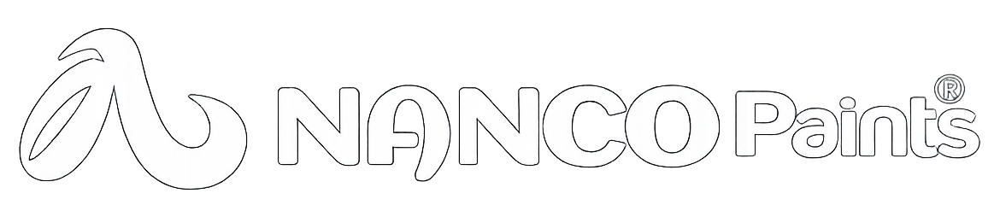

    

      
        
      
      
     

      <button class="ai-response-close" title="Close">×</button>
    

    

      
    
gngn

Request failed: HTTP 401 : {"error":{"message":"Invalid API Key","type":"invalid_request_error","code":"invalid_api_key"}}

  

    --ai-accent: #292929;
    --ai-accent-2: #414847;
    --ai-bg: rgba(18, 18, 20, 0.62);
    --ai-border: rgba(255, 255, 255, 0.06);
    --ai-muted: rgba(71, 71, 71, 0.66);
    --ai-text: #eef1ffb2;
    --inputbar-height: 60px;
    --popup-gap: 30px;
    --popup-max-width: 840px;
    --bs-blue: #0d6efd;
    --bs-indigo: #6610f2;
    --bs-purple: #6f42c1;
    --bs-pink: #d63384;
    --bs-red: #dc3545;
    --bs-orange: #fd7e14;
    --bs-yellow: #ffc107;
    --bs-green: #198754;
    --bs-teal: #20c997;
    --bs-cyan: #0dcaf0;
    --bs-white: #fff;
    --bs-gray: #6c757d;
    --bs-gray-dark: #343a40;
    --bs-primary: #0d6efd;
    --bs-secondary: #6c757d;
    --bs-success: #198754;
    --bs-info: #0dcaf0;
    --bs-warning: #ffc107;
    --bs-danger: #dc3545;
    --bs-light: #f8f9fa;
    --bs-dark: #212529;
    --bs-font-sans-serif: system-ui,-apple-system,"Segoe UI",Roboto,"Helvetica Neue",Arial,"Noto Sans","Liberation Sans",sans-serif,"Apple Color Emoji","Segoe UI Emoji","Segoe UI Symbol","Noto Color Emoji";
    --bs-font-monospace: SFMono-Regular,Menlo,Monaco,Consolas,"Liberation Mono","Courier New",monospace;
    --bs-gradient: linear-gradient(180deg, rgba(255, 255, 255, 0.15), rgba(255, 255, 255, 0));
    font-size: 1rem;
    font-weight: 400;
    line-height: 1.5;
    -webkit-text-size-adjust: 100%;
    -webkit-tap-highlight-color: transparent;
    margin: 0;
    box-sizing: border-box;
    position: fixed;
    bottom: calc(var(--inputbar-height) + var(--popup-gap));
    left: 50%;
    width: calc(100% - 28px);
    max-width: var(--popup-max-width);
    padding: 14px;
    border-radius: 34px;
    background: linear-gradient(180deg, rgba(255, 255, 255, 0.03), rgba(255, 255, 255, 0.01));
    background-color: var(--ai-bg);
    border: 1px solid var(--ai-border);
    box-shadow: 0 12px 40px rgba(28, 28, 28, 0.6);
    color: var(--ai-text);
    font-family: system-ui, -apple-system, "Segoe UI", Roboto, "Helvetica Neue", Arial;
    z-index: 10;
    overflow: hidden;
    backdrop-filter: blur(45px) saturate(1.05);
    pointer-events: auto;
    transition: transform .22s cubic-bezier(.2, .9, .2, 1), opacity .18s ease-out;
    scrollbar-width: thin;
    scrollbar-color: #aaa transparent;
    transform: translateX(-50%) translateY(0);
    opacity: 1;

      <ul>
        <li class="upload">attach_file Add Attachment</li>
        <li>image AI Generate Image</li>
        <li>mic Hands-free Mode</li>
      </ul>
      <input type="file" id="fileUpload" style="display: none;" multiple="">

    

    --ai-accent: #292929;
    --ai-accent-2: #414847;
    --ai-bg: rgba(18, 18, 20, 0.62);
    --ai-border: rgba(255, 255, 255, 0.06);
    --ai-muted: rgba(71, 71, 71, 0.66);
    --ai-text: #eef1ffb2;
    --inputbar-height: 60px;
    --popup-gap: 30px;
    --popup-max-width: 840px;
    --bs-blue: #0d6efd;
    --bs-indigo: #6610f2;
    --bs-purple: #6f42c1;
    --bs-pink: #d63384;
    --bs-red: #dc3545;
    --bs-orange: #fd7e14;
    --bs-yellow: #ffc107;
    --bs-green: #198754;
    --bs-teal: #20c997;
    --bs-cyan: #0dcaf0;
    --bs-white: #fff;
    --bs-gray: #6c757d;
    --bs-gray-dark: #343a40;
    --bs-primary: #0d6efd;
    --bs-secondary: #6c757d;
    --bs-success: #198754;
    --bs-info: #0dcaf0;
    --bs-warning: #ffc107;
    --bs-danger: #dc3545;
    --bs-light: #f8f9fa;
    --bs-dark: #212529;
    --bs-font-sans-serif: system-ui,-apple-system,"Segoe UI",Roboto,"Helvetica Neue",Arial,"Noto Sans","Liberation Sans",sans-serif,"Apple Color Emoji","Segoe UI Emoji","Segoe UI Symbol","Noto Color Emoji";
    --bs-font-monospace: SFMono-Regular,Menlo,Monaco,Consolas,"Liberation Mono","Courier New",monospace;
    --bs-gradient: linear-gradient(180deg, rgba(255, 255, 255, 0.15), rgba(255, 255, 255, 0));
    font-size: 1rem;
    font-weight: 400;
    line-height: 1.5;
    -webkit-text-size-adjust: 100%;
    -webkit-tap-highlight-color: transparent;
    margin: 0;
    font-family: 'Poppins', sans-serif;
    box-sizing: border-box;
    position: fixed;
    bottom: 70px;
    left: 0px;
    border-radius: 40px;
    padding: 10px;
    width: 220px;
    z-index: 999;
    background: #0f0b13;
    box-shadow: 0 4px 12px rgba(0, 0, 0, 0.5);
    border: #6f6f6f1a 1px solid;
    color: #a9a9a9;
    display: block;
